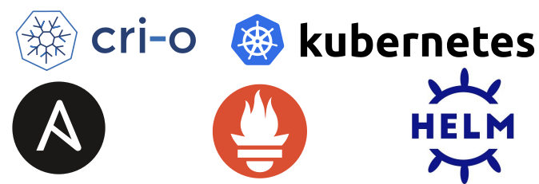

# Ansible Project (linuxtips)

<br />
<p align="center">
  <a href="https://github.com/othneildrew/Best-README-Template">
    
  </a>

  <h3 align="center">Ansible - Kubernetes</h3>
</p>

Tecnologies on project:
- AWS (EC2 and Security Group)
- Ansible
- CRI-O (Container Runtime)
- Kubernetes
- Helm
- Prometheus Operator
- Pod Network Project Calico

Pre-req to create resources on AWS:

```sh
sudo pip3 install boto3
```

To create and provisioning the machines on AWS you will need the credentials exported on Env of Linux

```sh
export AWS_ACCESS_KEY_ID='AK123'
export AWS_SECRET_ACCESS_KEY='abc123'
# You will need get this credentials on IAM of AWS

```

## Provisioning

On provisioning/roles/instances-aws/vars you will need declare the vars of AWS

```yaml
sec_group_name: # -> Security Group Name to create
instance_type: # -> type of hardware of instance
image: # -> AMI with ISO of Operation System
keypair: # -> SSH Keys of AWS (.Pem)
region: # -> Region of creation
count: 3 # -> Count of instances

```

Now just go to provisioning directory to run the playbook.

```sh
cd provisioning/

ls -lh
total 12K
-rw-r--r-- 1 felipe felipe  193 Jun  3 16:44 hosts
-rw-r--r-- 1 felipe felipe   41 Jun  2 19:46 main.yaml
drwxr-xr-x 3 felipe felipe 4.0K Jun  2 19:44 roles

ansible-playbook -i hosts --private-key=~/.ssh/<aws_ssh_key>.pem main.yaml

```

## Install K8S

```sh
cd install-kubernetes 

ls -lh
total 12K
-rw-r--r-- 1 felipe felipe  462 Jun  3 16:46 hosts
-rw-r--r-- 1 felipe felipe 1.4K Jun  3 15:47 main.yaml
drwxr-xr-x 7 felipe felipe 4.0K Jun  3 15:45 roles

vim hosts

```

```sh

[k8s-masters]
master ansible_host=node-1 ansible_ssh_host=#<Insert Public IP of Master on AWS>

[k8s-workers]
worker1 ansible_host=node-2 ansible_ssh_host=#<Insert Public IP of WORKER1 on AWS>
worker2 ansible_host=node-3 ansible_ssh_host=#<Insert Public IP of WORKER2 on AWS>

[kubernetes:children]
k8s-masters
k8s-workers

[kubernetes:vars]
hostname_master=node-1
hostname_worker1=node-2
hostname_worker2=node-3
K8S_MASTER_NODE_IP=#<Insert Private IP of Master on AWS>
K8s_WORKER1_NODE_IP=#<Insert Private IP of WORKER1 on AWS>
K8s_WORKER2_NODE_IP=#<Insert Private IP of WORKER2 on AWS>
K8S_API_SECURE_PORT=6443

```

### CRI-O Container Runtime

The container-runtime CRI-O needs bind the version with kubernetes version, this configuration can be changed on:

```sh

/install-kubernetes/roles/install-kubernetes/vars/main.yaml

vim main.yaml

```

```yaml

k8s_modules:
    - br_netfilter
    - ip_vs
    - ip_vs_rr
    - ip_vs_sh
    - ip_vs_wrr
    - overlay

CRIO_OS: xUbuntu_18.04 # Insert here the OS env of CRI-O
CRIO_VERSION: 1.21 # Insert here the VERSION env of CRI-O

# On this commit the CRI-O bind with Kubernetes 1.21.1

```

The table to binding with Kubernetes can be found below:

<https://cri-o.io/>

With all IP's configured on invetory file of ansible, just run the playbook.

```sh

pwd   

/projeto-ansible-linuxtips/install-kubernetes

ansible-playbook -i hosts --private-key=~/.ssh/<aws_ssh_key>.pem main.yaml

```